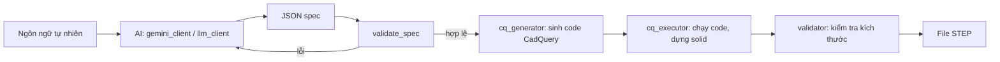

# CAD-AI: từ mô tả tiếng Việt đến mô hình 3D

Người dùng gõ yêu cầu thiết kế bằng ngôn ngữ tự nhiên, hệ thống chuyển thành
JSON spec, sinh code CadQuery, dựng hình 3D và xuất file STEP.

## 1. Pipeline



## 2. Các bước đang thực hiện

| Bước | Module | Làm gì |
|---|---|---|
| 1. Phân tích | `gemini_client.py`, `llm_client.py` | AI đọc yêu cầu, trả JSON spec hoặc `{"error": ...}` |
| 2. Kiểm tra spec | `spec_schema.py` | Kiểm tra loại chi tiết, kích thước bắt buộc, ràng buộc hình học |
| 3. Sinh code | `cq_generator.py` | Ghép code CadQuery từ spec theo template |
| 4. Dựng hình | `cq_executor.py` | Chạy code trong tiến trình riêng, xuất STEP |
| 5. Kiểm tra hình | `validator.py` | So kết quả dựng với spec |
| 6. Điều phối | `pipeline.py` | Nối các bước, thử sửa spec khi có lỗi |
| 7. Giao diện | `web/app.py`, `run_server.py` | API FastAPI và trang web |

## 3. Đầu vào và đầu ra

| Bước | Đầu vào | Đầu ra |
|---|---|---|
| Phân tích | Câu tiếng Việt | `PartSpec` (JSON) hoặc lỗi |
| Kiểm tra spec | `PartSpec` | Danh sách lỗi (rỗng nếu hợp lệ) |
| Sinh code | `PartSpec` | Chuỗi code CadQuery |
| Dựng hình | Code CadQuery | File `.step`, `ExecutionResult` |
| Kiểm tra hình | Spec + kết quả dựng | `ValidationReport` |

## 4. Cách kiểm tra từng công đoạn

- **Spec và sinh code:** `python -m tests.test_schema_and_generator`
- **Chi tiết gối đỡ trục:** `python -m tests.test_new`
- **Import toàn hệ thống:** `python -c "import pipeline, gemini_client; from web.app import app"`
- **Hình 3D:** mở file `.step` bằng FreeCAD và so với bản vẽ.

## 5. Cấu trúc thư mục

```
cad-ai-project/
├── spec_schema.py     # định nghĩa và kiểm tra spec
├── llm_client.py      # SYSTEM_PROMPT, client Claude
├── gemini_client.py   # client Gemini (web đang dùng)
├── cq_generator.py    # spec -> code CadQuery
├── cq_executor.py     # chạy code, xuất STEP
├── validator.py       # kiểm tra kết quả
├── pipeline.py        # nối các bước
├── run_server.py      # khởi động web
├── web/               # giao diện và API
├── examples/          # câu mẫu và spec mẫu
├── tests/             # test từng công đoạn
└── scratch/           # script thử nghiệm làm tay (không thuộc pipeline)
```

## Chạy thử

```
pip install -r requirements.txt
python run_server.py
```

Cần đặt biến môi trường chứa API key của Gemini (tên biến xem trong `gemini_client.py`).

## Loại chi tiết hỗ trợ

plate, bracket, flange, shaft, stepped_shaft, housing, pillow_block.